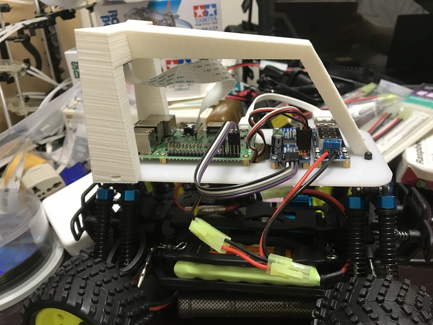

# rocinante



最初のDonkey Carアプリ用のリポジトリ。

## 車両仕様

* [Robocar Store](https://www.robocarstore.com/) Donkey Car Starter Kit (Full Kit/US Plug)
  * Raspberry Pi 3B+
  * PCA9685 Survo Controller

* donkeycar v 2.5.8
 * donkeyparts
 * TensorFlow v 1.7.0


## セットアップ


`donkey createcar` コマンドを使って 独自 Donkey Car アプリ用ディレクトリを作成したあと、次のコマンドを実行します。

```bash
git clone https://github.com/autorope/donkeypart_ps3_controller.git
cd donkeypart_ps3_controller
git checkout master
pip install -e .
```

### PS3コントローラを利用する場合

[このドキュメント](./docs/sixaxis_setup.md) を参考にセットアップを行ってください。


